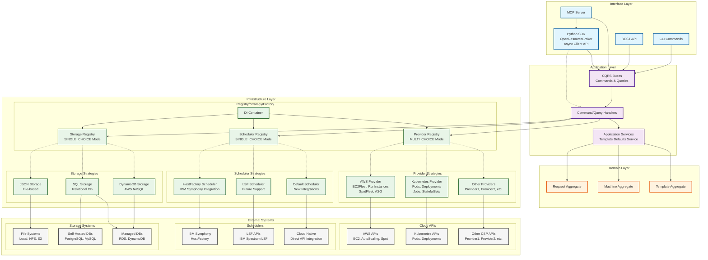

```mermaid
graph TD
    %% Interface Layer
    subgraph "Interface Layer"
        CLI[CLI Commands]
        API[REST API]
        MCP[MCP Server]
        SDK[Python SDK<br/>OpenResourceBroker<br/>Async Client API]
    end

    %% Application Layer
    subgraph "Application Layer"
        CQRS[CQRS Buses<br/>Commands & Queries]
        HANDLERS[Command/Query Handlers]
        APPSERVICES[Application Services<br/>Template Defaults Service]
    end

    %% Domain Layer
    subgraph "Domain Layer"
        AGG1[Request Aggregate]
        AGG2[Machine Aggregate]
        AGG3[Template Aggregate]
    end

    %% Infrastructure Layer
    subgraph "Infrastructure Layer"
        subgraph "Registry/Strategy/Factory"
            DI[DI Container]
            PREG[Provider Registry<br/>MULTI_CHOICE Mode]
            SREG[Scheduler Registry<br/>SINGLE_CHOICE Mode]
            STREG[Storage Registry<br/>SINGLE_CHOICE Mode]
        end

        subgraph "Provider Strategies"
            AWS[AWS Provider<br/>EC2Fleet, RunInstances<br/>SpotFleet, ASG]
            K8S[Kubernetes Provider<br/>Pods, Deployments<br/>Jobs, StatefulSets]
            OTHERPROV[Other Providers<br/>Provider1, Provider2, etc.]
        end

        subgraph "Scheduler Strategies"
            HF[HostFactory Scheduler<br/>IBM Symphony Integration]
            DEF[Default Scheduler<br/>New Integrations]
            LSF[LSF Scheduler<br/>Future Support]
        end

        subgraph "Storage Strategies"
            JSON[JSON Storage<br/>File-based]
            DYNAMO[DynamoDB Storage<br/>AWS NoSQL]
            SQL[SQL Storage<br/>Relational DB]
        end
    end

    %% External Systems (Grouped)
    subgraph "External Systems"
        subgraph "Cloud APIs"
            AWSAPI[AWS APIs<br/>EC2, AutoScaling, Spot]
            K8SAPI[Kubernetes APIs<br/>Pods, Deployments]
            OTHERCLOUD[Other CSP APIs<br/>Provider1, Provider2, etc.]
        end

        subgraph "Schedulers"
            SYMPHONY[IBM Symphony<br/>HostFactory]
            LSFAPI[LSF APIs<br/>IBM Spectrum LSF]
            CLOUDNATIVE[Cloud Native<br/>Direct API Integration]
        end

        subgraph "Storage Systems"
            FILESYSTEM[File Systems<br/>Local, NFS, S3]
            SELFDB[Self-Hosted DBs<br/>PostgreSQL, MySQL]
            MANAGEDDB[Managed DBs<br/>RDS, DynamoDB]
        end
    end

    %% Connections
    CLI --> CQRS
    API --> CQRS
    MCP --> CQRS
    SDK --> CQRS

    CQRS --> HANDLERS
    HANDLERS --> APPSERVICES
    APPSERVICES --> AGG1
    APPSERVICES --> AGG2
    APPSERVICES --> AGG3

    %% Handlers use infrastructure via registries
    HANDLERS --> PREG
    HANDLERS --> SREG
    HANDLERS --> STREG

    %% DI orchestrates registries
    DI --> PREG
    DI --> SREG
    DI --> STREG

    %% Registries create strategies
    PREG -.-> AWS
    PREG -.-> K8S
    PREG -.-> OTHERPROV
    SREG -.-> HF
    SREG -.-> DEF
    SREG -.-> LSF
    STREG -.-> JSON
    STREG -.-> DYNAMO
    STREG -.-> SQL

    %% Strategies connect to external systems
    AWS --> AWSAPI
    K8S --> K8SAPI
    OTHERPROV --> OTHERCLOUD

    HF --> SYMPHONY
    DEF --> CLOUDNATIVE
    LSF --> LSFAPI

    JSON --> FILESYSTEM
    DYNAMO --> MANAGEDDB
    SQL --> SELFDB
    SQL --> MANAGEDDB

    %% SDK Discovery (automatic method exposure)
    SDK -.-> HANDLERS
    MCP -.-> SDK

    %% Styling
    classDef interface fill:#e1f5fe,stroke:#01579b,stroke-width:2px
    classDef application fill:#f3e5f5,stroke:#4a148c,stroke-width:2px
    classDef domain fill:#fff3e0,stroke:#e65100,stroke-width:2px
    classDef infrastructure fill:#e8f5e8,stroke:#1b5e20,stroke-width:2px
    classDef external fill:#f5f5f5,stroke:#424242,stroke-width:2px

    class CLI,API,MCP,SDK interface
    class CQRS,HANDLERS,APPSERVICES application
    class AGG1,AGG2,AGG3,PORTS,EVENTS domain
    class DI,PREG,SREG,STREG,AWS,K8S,OTHERPROV,HF,DEF,LSF,JSON,DYNAMO,SQL infrastructure
    class AWSAPI,K8SAPI,OTHERCLOUD,SYMPHONY,LSFAPI,CLOUDNATIVE,FILESYSTEM,SELFDB,MANAGEDDB external
```
