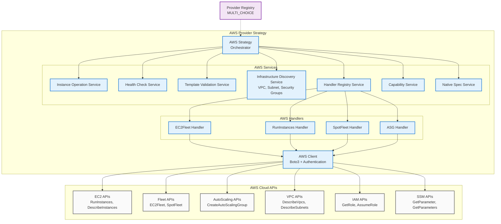
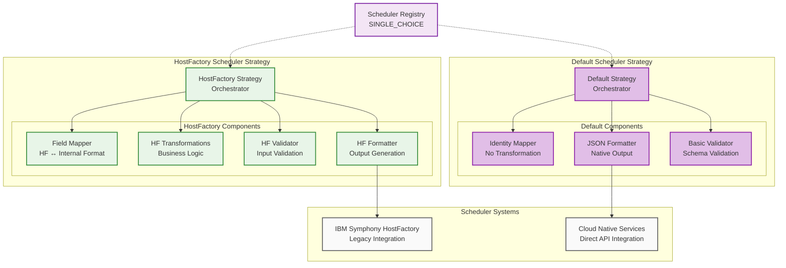

# System Architecture Diagrams

This document provides comprehensive architectural diagrams for the Open Resource Broker system, showing the complete system architecture and detailed implementation views.

## High-Level System Architecture

The following diagram shows the complete ORB architecture with all layers and components:

```mermaid
graph TD
    %% Interface Layer
    subgraph "Interface Layer"
        CLI[CLI Commands]
        API[REST API]
        MCP[MCP Server]
        SDK[Python SDK<br/>ORBClient<br/>Async Client API]
    end

    %% Application Layer
    subgraph "Application Layer"
        CQRS[CQRS Buses<br/>Commands & Queries]
        HANDLERS[Command/Query Handlers]
        APPSERVICES[Application Services<br/>Template Defaults Service]
    end

    %% Domain Layer
    subgraph "Domain Layer"
        AGG1[Request Aggregate]
        AGG2[Machine Aggregate]
        AGG3[Template Aggregate]
    end

    %% Infrastructure Layer
    subgraph "Infrastructure Layer"
        subgraph "Registry/Strategy/Factory"
            DI[DI Container]
            PREG[Provider Registry<br/>MULTI_CHOICE Mode]
            SREG[Scheduler Registry<br/>SINGLE_CHOICE Mode]
            STREG[Storage Registry<br/>SINGLE_CHOICE Mode]
        end

        subgraph "Provider Strategies"
            AWS[AWS Provider<br/>EC2Fleet, RunInstances<br/>SpotFleet, ASG]
            K8S[Kubernetes Provider<br/>Pods, Deployments<br/>Jobs, StatefulSets]
            OTHERPROV[Other Providers<br/>Provider1, Provider2, etc.]
        end

        subgraph "Scheduler Strategies"
            HF[HostFactory Scheduler<br/>IBM Symphony Integration]
            DEF[Default Scheduler<br/>New Integrations]
            LSF[LSF Scheduler<br/>Future Support]
        end

        subgraph "Storage Strategies"
            JSON[JSON Storage<br/>File-based]
            DYNAMO[DynamoDB Storage<br/>AWS NoSQL]
            SQL[SQL Storage<br/>Relational DB]
        end
    end

    %% External Systems (Grouped)
    subgraph "External Systems"
        subgraph "Cloud APIs"
            AWSAPI[AWS APIs<br/>EC2, AutoScaling, Spot]
            K8SAPI[Kubernetes APIs<br/>Pods, Deployments]
            OTHERCLOUD[Other CSP APIs<br/>Provider1, Provider2, etc.]
        end

        subgraph "Schedulers"
            SYMPHONY[IBM Symphony<br/>HostFactory]
            LSFAPI[LSF APIs<br/>IBM Spectrum LSF]
            CLOUDNATIVE[Cloud Native<br/>Direct API Integration]
        end

        subgraph "Storage Systems"
            FILESYSTEM[File Systems<br/>Local Files]
            SELFDB[Self-Hosted DBs<br/>PostgreSQL, MySQL]
            MANAGEDDB[Managed DBs<br/>RDS, DynamoDB]
        end
    end

    %% Connections
    CLI --> CQRS
    API --> CQRS
    MCP --> CQRS
    SDK --> CQRS

    CQRS --> HANDLERS
    HANDLERS --> APPSERVICES
    APPSERVICES --> AGG1
    APPSERVICES --> AGG2
    APPSERVICES --> AGG3

    %% Handlers use infrastructure via registries
    HANDLERS --> PREG
    HANDLERS --> SREG
    HANDLERS --> STREG

    %% DI orchestrates registries
    DI --> PREG
    DI --> SREG
    DI --> STREG

    %% Registries create strategies
    PREG -.-> AWS
    PREG -.-> K8S
    PREG -.-> OTHERPROV
    SREG -.-> HF
    SREG -.-> DEF
    SREG -.-> LSF
    STREG -.-> JSON
    STREG -.-> DYNAMO
    STREG -.-> SQL

    %% Strategies connect to external systems
    AWS --> AWSAPI
    K8S --> K8SAPI
    OTHERPROV --> OTHERCLOUD

    HF --> SYMPHONY
    DEF --> CLOUDNATIVE
    LSF --> LSFAPI

    JSON --> FILESYSTEM
    DYNAMO --> MANAGEDDB
    SQL --> SELFDB
    SQL --> MANAGEDDB

    %% SDK Discovery (automatic method exposure)
    SDK -.-> HANDLERS
    MCP -.-> SDK

    %% Styling (Switched Infrastructure and Domain Colors)
    classDef interface fill:#e3f2fd,stroke:#1976d2,stroke-width:2px
    classDef application fill:#f3e5f5,stroke:#7b1fa2,stroke-width:2px
    classDef domain fill:#fff3e0,stroke:#f57c00,stroke-width:2px
    classDef infrastructure fill:#e8f5e8,stroke:#388e3c,stroke-width:2px
    classDef external fill:#fafafa,stroke:#616161,stroke-width:2px

    class CLI,API,MCP,SDK interface
    class CQRS,HANDLERS,APPSERVICES application
    class AGG1,AGG2,AGG3 domain
    class DI,PREG,SREG,STREG,AWS,K8S,OTHERPROV,HF,DEF,LSF,JSON,DYNAMO,SQL infrastructure
    class AWSAPI,K8SAPI,OTHERCLOUD,SYMPHONY,LSFAPI,CLOUDNATIVE,FILESYSTEM,SELFDB,MANAGEDDB external
```

## AWS Provider Implementation

This diagram shows the detailed AWS provider implementation with all services and handlers:

## Scheduler Strategies Implementation

This diagram shows the scheduler strategies and their components:

## Storage Strategies Implementation

This diagram shows the storage strategies and their components:

```mermaid
graph TD
    %% Registry Entry Point
    STREG[Storage Registry<br/>SINGLE_CHOICE]

    %% Storage Implementations
    subgraph "JSON Storage Strategy"
        JSONSTRAT[JSON Strategy<br/>Orchestrator]
        
        subgraph "JSON Components"
            JSONFILE[File Manager<br/>Read/Write Operations]
            JSONSER[JSON Serializer<br/>Object ↔ JSON]
            JSONLOCK[Lock Manager<br/>File Locking]
            JSONTX[Memory Transaction Manager<br/>In-Memory Transactions]
        end
    end

    subgraph "DynamoDB Storage Strategy"
        DYNAMOSTRAT[DynamoDB Strategy<br/>Orchestrator]
        
        subgraph "DynamoDB Components"
            DYNAMOCLIENT[Client Manager<br/>AWS SDK Management]
            DYNAMOCONV[Converter<br/>Object ↔ DynamoDB]
            DYNAMOLOCK[Lock Manager<br/>Distributed Locking]
            DYNAMOTX[Transaction Manager<br/>DynamoDB Transactions]
        end
    end

    subgraph "SQL Storage Strategy"
        SQLSTRAT[SQL Strategy<br/>Orchestrator]
        
        subgraph "SQL Components"
            SQLCONN[Connection Manager<br/>Pool Management]
            SQLQUERY[Query Builder<br/>Dynamic SQL Generation]
            SQLSER[SQL Serializer<br/>Object ↔ Relational]
            SQLLOCK[Lock Manager<br/>Row/Table Locking]
        end
    end

    %% External Storage Systems
    subgraph "Storage Systems"
        FILESYSTEM[Local File System<br/>JSON Files]
        DYNAMODB[AWS DynamoDB<br/>NoSQL Database]
        POSTGRESQL[PostgreSQL<br/>Relational Database]
        MYSQL[MySQL<br/>Relational Database]
        SQLITE[SQLite<br/>Embedded Database]
    end

    %% Registry connections
    STREG -.-> JSONSTRAT
    STREG -.-> DYNAMOSTRAT
    STREG -.-> SQLSTRAT

    %% Storage flows
    JSONSTRAT --> JSONFILE
    JSONSTRAT --> JSONSER
    JSONSTRAT --> JSONLOCK
    JSONSTRAT --> JSONTX

    DYNAMOSTRAT --> DYNAMOCLIENT
    DYNAMOSTRAT --> DYNAMOCONV
    DYNAMOSTRAT --> DYNAMOLOCK
    DYNAMOSTRAT --> DYNAMOTX

    SQLSTRAT --> SQLCONN
    SQLSTRAT --> SQLQUERY
    SQLSTRAT --> SQLSER
    SQLSTRAT --> SQLLOCK

    %% External connections
    JSONFILE --> FILESYSTEM
    DYNAMOCLIENT --> DYNAMODB
    SQLCONN --> POSTGRESQL
    SQLCONN --> MYSQL
    SQLCONN --> SQLITE

    %% Styling (Light Colors)
    classDef registry fill:#f3e5f5,stroke:#7b1fa2,stroke-width:2px
    classDef json fill:#e8f5e8,stroke:#388e3c,stroke-width:2px
    classDef dynamo fill:#e3f2fd,stroke:#1976d2,stroke-width:2px
    classDef sql fill:#fff3e0,stroke:#f57c00,stroke-width:2px
    classDef external fill:#fafafa,stroke:#616161,stroke-width:2px

    class STREG registry
    class JSONSTRAT,JSONFILE,JSONSER,JSONLOCK,JSONTX json
    class DYNAMOSTRAT,DYNAMOCLIENT,DYNAMOCONV,DYNAMOLOCK,DYNAMOTX dynamo
    class SQLSTRAT,SQLCONN,SQLQUERY,SQLSER,SQLLOCK sql
    class FILESYSTEM,DYNAMODB,POSTGRESQL,MYSQL,SQLITE external
```

## Architecture Principles

### Clean Architecture Layers

The system follows Clean Architecture principles with clear layer separation:

- **Interface Layer**: CLI, REST API, MCP Server, Python SDK
- **Application Layer**: CQRS buses, handlers, application services
- **Domain Layer**: Aggregates (Request, Machine, Template)
- **Infrastructure Layer**: Registries, strategies, external integrations

### Registry Pattern

All strategies use a unified registry pattern:

- **Provider Registry**: MULTI_CHOICE mode (multiple providers simultaneously)
- **Scheduler Registry**: SINGLE_CHOICE mode (one scheduler at a time)
- **Storage Registry**: SINGLE_CHOICE mode (one storage strategy at a time)

### Strategy Pattern

Each registry manages strategies for different concerns:

- **Provider Strategies**: Cloud provider integrations (AWS, Kubernetes, etc.)
- **Scheduler Strategies**: Output format strategies (HostFactory, Default)
- **Storage Strategies**: Persistence strategies (JSON, DynamoDB, SQL)

### Dependency Injection

The DI Container orchestrates all registries and manages dependencies across the system, ensuring proper separation of concerns and testability.

## Full System Architecture

