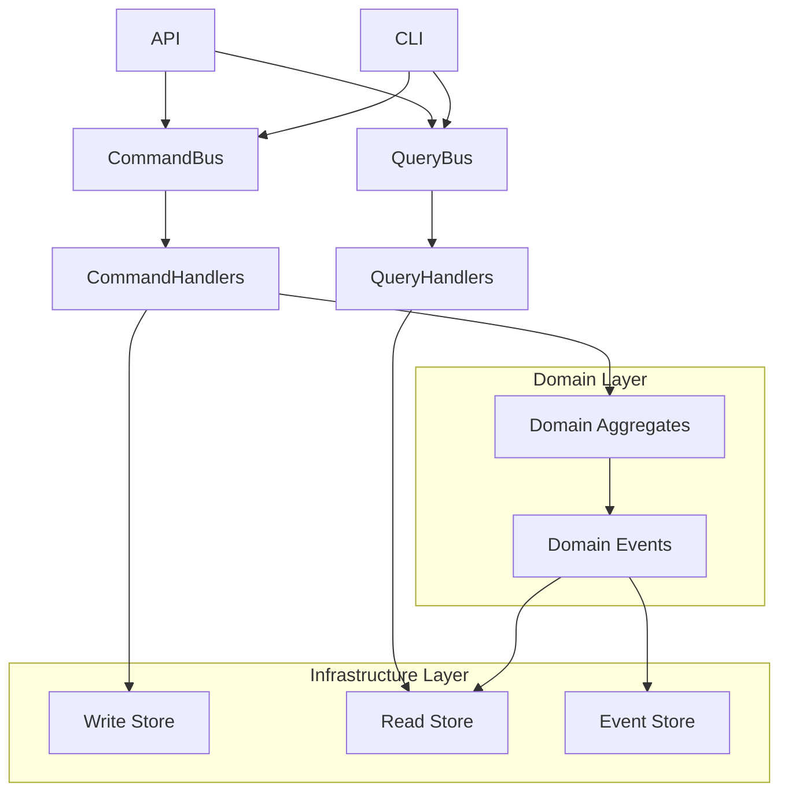

# CQRS Implementation - Developer Guide

## Prerequisites

Before implementing CQRS patterns, ensure you understand:
- [Dependency Injection basics](./dependency_injection.md)
- Command and Query separation principles
- [Domain-Driven Design concepts](../architecture/clean_architecture.md)

This guide provides practical implementation guidance for using CQRS in the Open Resource Broker. For comprehensive technical details and pattern theory, see the [Architecture Reference](../architecture/cqrs_pattern.md).

## Next Steps

After implementing CQRS patterns:
1. **[Event Handling](./events.md)** - Domain events and event handlers
2. **[Testing CQRS](../developer_guide/testing.md)** - Testing commands and queries
3. **[CQRS Patterns](../architecture/cqrs_pattern.md)** - Additional CQRS patterns and optimizations

## Quick Start Guide

### Creating Commands

Commands represent intentions to change system state:

```python
from dataclasses import dataclass
from src.application.dto.commands import BaseCommand

@dataclass
class RequestMachinesCommand(BaseCommand):
    """Command to request new machines."""
    template_name: str
    machine_count: int
    user_id: str
    configuration: dict
```

### Creating Command Handlers

```python
from src.domain.base.dependency_injection import command_handler
from src.application.dto.commands import RequestMachinesCommand

@command_handler(RequestMachinesCommand)
class RequestMachinesHandler:
    def __init__(self, provider_context: ProviderContext, logger: LoggingPort):
        self._provider_context = provider_context
        self._logger = logger

    def handle(self, command: RequestMachinesCommand) -> MachineResponse:
        # Implementation logic
        pass
```

### Creating Queries

```python
from dataclasses import dataclass
from src.application.dto.queries import BaseQuery

@dataclass
class GetMachineStatusQuery(BaseQuery):
    """Query to get machine status."""
    request_id: str
```

### Creating Query Handlers

```python
from src.domain.base.dependency_injection import query_handler
from src.application.dto.queries import GetMachineStatusQuery

@query_handler(GetMachineStatusQuery)
class GetMachineStatusHandler:
    def __init__(self, storage: StoragePort, logger: LoggingPort):
        self._storage = storage
        self._logger = logger

    def handle(self, query: GetMachineStatusQuery) -> MachineStatusResponse:
        # Implementation logic
        pass
```



## Command Side

### Command Pattern

Commands represent write operations that change system state:

```python
@dataclass(frozen=True)
class CreateRequestCommand:
    """Command to create a new machine request."""
    template_id: str
    machine_count: int
    tags: Optional[Dict[str, str]] = None
    priority: Optional[int] = None

    def validate(self) -> None:
        """Validate command parameters."""
        if not self.template_id:
            raise ValidationError("template_id is required")
        if self.machine_count <= 0:
            raise ValidationError("machine_count must be positive")
        if self.machine_count > 100:
            raise ValidationError("machine_count cannot exceed 100")

@dataclass(frozen=True)
class UpdateRequestStatusCommand:
    """Command to update request status."""
    request_id: str
    new_status: RequestStatus
    reason: Optional[str] = None

    def validate(self) -> None:
        if not self.request_id:
            raise ValidationError("request_id is required")
        if not isinstance(self.new_status, RequestStatus):
            raise ValidationError("new_status must be a valid RequestStatus")
```

### Command Handlers

Command handlers execute business logic and modify domain state:

```python
class CreateRequestCommandHandler:
    """Handles request creation commands."""

    def __init__(self,
                 request_repository: RequestRepository,
                 template_repository: TemplateRepository,
                 event_publisher: EventPublisher):
        self._request_repository = request_repository
        self._template_repository = template_repository
        self._event_publisher = event_publisher
        self._logger = get_logger(__name__)

    async def handle(self, command: CreateRequestCommand) -> str:
        """Handle the create request command."""
        try:
            # Validate command
            command.validate()

            # Verify template exists
            template = await self._template_repository.get_by_id(command.template_id)
            if not template:
                raise TemplateNotFoundError(f"Template {command.template_id} not found")

            # Create new request aggregate
            request = Request.create_new_request(
                template_id=command.template_id,
                machine_count=command.machine_count,
                tags=command.tags,
                priority=command.priority
            )

            # Save to repository
            await self._request_repository.save(request)

            # Publish domain events
            events = request.get_domain_events()
            await self._event_publisher.publish_events(events)

            self._logger.info(f"Created request {request.request_id}")
            return request.request_id

        except Exception as e:
            self._logger.error(f"Failed to create request: {str(e)}")
            raise
```

### Command Bus

The command bus routes commands to their appropriate handlers:

```python
class CommandBus:
    """Routes commands to their handlers."""

    def __init__(self):
        self._handlers: Dict[Type, Any] = {}
        self._logger = get_logger(__name__)

    def register_handler(self, command_type: Type, handler: Any) -> None:
        """Register a command handler."""
        self._handlers[command_type] = handler
        self._logger.debug(f"Registered handler for {command_type.__name__}")

    async def dispatch(self, command: Any) -> Any:
        """Dispatch a command to its handler."""
        command_type = type(command)

        if command_type not in self._handlers:
            raise HandlerNotFoundError(f"No handler registered for {command_type.__name__}")

        handler = self._handlers[command_type]

        try:
            self._logger.debug(f"Dispatching {command_type.__name__}")
            result = await handler.handle(command)
            self._logger.debug(f"Successfully handled {command_type.__name__}")
            return result

        except Exception as e:
            self._logger.error(f"Command handling failed for {command_type.__name__}: {str(e)}")
            raise
```

## Query Side

### Query Pattern

Queries represent read operations that don't change system state:

```python
@dataclass(frozen=True)
class GetRequestQuery:
    """Query to get a specific request."""
    request_id: str

    def validate(self) -> None:
        if not self.request_id:
            raise ValidationError("request_id is required")

@dataclass(frozen=True)
class ListRequestsQuery:
    """Query to list requests with filtering."""
    status: Optional[RequestStatus] = None
    template_id: Optional[str] = None
    limit: int = 50
    offset: int = 0

    def validate(self) -> None:
        if self.limit <= 0 or self.limit > 1000:
            raise ValidationError("limit must be between 1 and 1000")
        if self.offset < 0:
            raise ValidationError("offset must be non-negative")

@dataclass(frozen=True)
class GetRequestStatusQuery:
    """Query to get request status information."""
    request_id: str
    include_machines: bool = False

    def validate(self) -> None:
        if not self.request_id:
            raise ValidationError("request_id is required")
```

### Query Handlers

Query handlers retrieve and format data for read operations:

```python
class GetRequestQueryHandler:
    """Handles request retrieval queries."""

    def __init__(self, request_read_model: RequestReadModel):
        self._read_model = request_read_model
        self._logger = get_logger(__name__)

    async def handle(self, query: GetRequestQuery) -> Optional[RequestDto]:
        """Handle the get request query."""
        try:
            query.validate()

            request_data = await self._read_model.get_request(query.request_id)

            if not request_data:
                return None

            return RequestDto.from_dict(request_data)

        except Exception as e:
            self._logger.error(f"Failed to get request {query.request_id}: {str(e)}")
            raise

class ListRequestsQueryHandler:
    """Handles request listing queries."""

    def __init__(self, request_read_model: RequestReadModel):
        self._read_model = request_read_model
        self._logger = get_logger(__name__)

    async def handle(self, query: ListRequestsQuery) -> List[RequestDto]:
        """Handle the list requests query."""
        try:
            query.validate()

            filters = {}
            if query.status:
                filters['status'] = query.status.value
            if query.template_id:
                filters['template_id'] = query.template_id

            requests_data = await self._read_model.list_requests(
                filters=filters,
                limit=query.limit,
                offset=query.offset
            )

            return [RequestDto.from_dict(data) for data in requests_data]

        except Exception as e:
            self._logger.error(f"Failed to list requests: {str(e)}")
            raise
```

### Query Bus

The query bus routes queries to their appropriate handlers:

```python
class QueryBus:
    """Routes queries to their handlers."""

    def __init__(self):
        self._handlers: Dict[Type, Any] = {}
        self._logger = get_logger(__name__)

    def register_handler(self, query_type: Type, handler: Any) -> None:
        """Register a query handler."""
        self._handlers[query_type] = handler
        self._logger.debug(f"Registered handler for {query_type.__name__}")

    async def dispatch(self, query: Any) -> Any:
        """Dispatch a query to its handler."""
        query_type = type(query)

        if query_type not in self._handlers:
            raise HandlerNotFoundError(f"No handler registered for {query_type.__name__}")

        handler = self._handlers[query_type]

        try:
            self._logger.debug(f"Dispatching {query_type.__name__}")
            result = await handler.handle(query)
            self._logger.debug(f"Successfully handled {query_type.__name__}")
            return result

        except Exception as e:
            self._logger.error(f"Query handling failed for {query_type.__name__}: {str(e)}")
            raise
```

## Read Models

### Request Read Model

Optimized data structure for request queries:

```python
class RequestReadModel:
    """Optimized read model for request queries."""

    def __init__(self, storage: ReadModelStorage):
        self._storage = storage
        self._logger = get_logger(__name__)

    async def get_request(self, request_id: str) -> Optional[Dict[str, Any]]:
        """Get a single request by ID."""
        try:
            return await self._storage.get_document("requests", request_id)
        except Exception as e:
            self._logger.error(f"Failed to get request {request_id}: {str(e)}")
            raise

    async def list_requests(self,
                          filters: Dict[str, Any] = None,
                          limit: int = 50,
                          offset: int = 0) -> List[Dict[str, Any]]:
        """List requests with filtering and pagination."""
        try:
            return await self._storage.query_documents(
                collection="requests",
                filters=filters or {},
                limit=limit,
                offset=offset,
                sort_by="created_at",
                sort_order="desc"
            )
        except Exception as e:
            self._logger.error(f"Failed to list requests: {str(e)}")
            raise
```

## Data Transfer Objects (DTOs)

### Request DTOs

```python
@dataclass
class RequestDto:
    """Data transfer object for request data."""
    request_id: str
    template_id: str
    machine_count: int
    status: str
    created_at: datetime
    updated_at: Optional[datetime] = None
    completed_at: Optional[datetime] = None
    tags: Optional[Dict[str, str]] = None
    priority: Optional[int] = None
    machine_ids: Optional[List[str]] = None

    @classmethod
    def from_dict(cls, data: Dict[str, Any]) -> 'RequestDto':
        """Create DTO from dictionary."""
        return cls(
            request_id=data['request_id'],
            template_id=data['template_id'],
            machine_count=data['machine_count'],
            status=data['status'],
            created_at=datetime.fromisoformat(data['created_at']),
            updated_at=datetime.fromisoformat(data['updated_at']) if data.get('updated_at') else None,
            completed_at=datetime.fromisoformat(data['completed_at']) if data.get('completed_at') else None,
            tags=data.get('tags'),
            priority=data.get('priority'),
            machine_ids=data.get('machine_ids', [])
        )
```

## CQRS Configuration

### Handler Registration

```python
def configure_cqrs(container: DIContainer) -> Tuple[CommandBus, QueryBus]:
    """Configure CQRS command and query buses."""

    # Create buses
    command_bus = CommandBus()
    query_bus = QueryBus()

    # Get dependencies from container
    request_repository = container.get(RequestRepository)
    template_repository = container.get(TemplateRepository)
    event_publisher = container.get(EventPublisher)

    request_read_model = container.get(RequestReadModel)

    # Register command handlers
    command_bus.register_handler(
        CreateRequestCommand,
        CreateRequestCommandHandler(request_repository, template_repository, event_publisher)
    )

    # Register query handlers
    query_bus.register_handler(
        GetRequestQuery,
        GetRequestQueryHandler(request_read_model)
    )

    return command_bus, query_bus
```

## Usage Examples

### Command Usage

```python
# Create a new request
command = CreateRequestCommand(
    template_id="template-1",
    machine_count=3,
    tags={"environment": "production", "team": "backend"}
)

request_id = await command_bus.dispatch(command)
print(f"Created request: {request_id}")
```

### Query Usage

```python
# Get a specific request
query = GetRequestQuery(request_id="req-123")
request = await query_bus.dispatch(query)

if request:
    print(f"Request {request.request_id} status: {request.status}")
else:
    print("Request not found")
```

## Best Practices

### Command Design
- **Single Responsibility**: Each command should represent one business operation
- **Immutable**: Commands should be immutable once created
- **Validation**: Include validation logic in commands
- **Rich Information**: Include all necessary data for the operation

### Query Design
- **Read-Only**: Queries should never modify state
- **Optimized**: Design queries for specific read scenarios
- **Pagination**: Support pagination for list queries
- **Filtering**: Provide flexible filtering options

## Next Steps

- **[Event System](events.md)**: Learn about the event-driven architecture
- **[Architecture](architecture.md)**: Understand the overall system design
- **[API Reference](../api/readme.md)**: Explore the application layer API
- **[Development](development.md)**: Set up development environment
