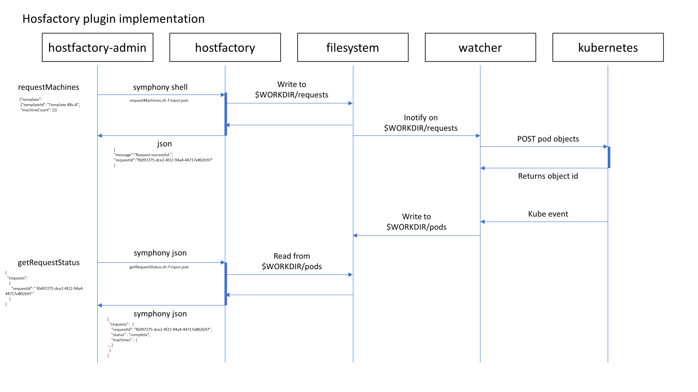

[](https://community.finos.org/docs/governance/Software-Projects/stages/incubating)

# Open Resource Broker

## Symphony on K8s HostFactory Provider

> **Note:** This plugin is in maintenance mode.  A modern Kubernetes
> provider with native ORB integration is in development.  New
> deployments should evaluate the modern provider when available;
> existing deployments remain fully supported.

This provider extends the
[IBM Symphony HostFactory custom provider](https://www.ibm.com/docs/en/spectrum-symphony/7.3.2?topic=factory-provider-plug-in-interface-specification)
to provision Symphony compute nodes on Kubernetes.


## Overview

IBM Symphony HostFactory is a service that runs as part of IBM Symphony Orchestrator.
The HostFactory service manages compute host bursting to public cloud. HostFactory provides a custom provider extension to allow use-case specific implementation of the host provider.
[HostFactory overview](https://www.ibm.com/docs/en/spectrum-symphony/7.3.2?topic=factory-overview).




### Prerequisites

The plugin should be installed as part of an IBM Symphony deployment with
the necessary credentials/capabilities to deploy pods on a Kubernetes cluster.


### Provider installation

Install the package:

```bash
pip install "orb-py[k8s-legacy]"
```

The provider scripts `k8s-hf` should be part of the `${HF_CONFDIR}` under Symphony and [hostProviderPlugins.json](https://www.ibm.com/docs/en/spectrum-symphony/7.3.2?topic=factory-hostproviderpluginsjson) should add the plugin name:
```
{
    "version": 2,
    "providerplugins": [
        {
            "name": "k8s-hf",
            "enabled": 1,
            "scriptPath": "${HF_CONFDIR}/providers/k8s-hf/scripts/"
        }
    ]
}
```

as for the script files and
[hostProviders.json](https://www.ibm.com/docs/en/spectrum-symphony/7.3.2?topic=factory-hostprovidersjson)
they should be copied under `${HF_CONFDIR}` in the following tree structure
```
├── providers
│   ├── hostProviders.json
│   └── k8s-hf
│       └── scripts
│           ├── getAvailableTemplates.sh
│           ├── getRequestStatus.sh
│           ├── getReturnRequests.sh
│           ├── requestMachines.sh
│           └── requestReturnMachines.sh
```

The `orb` binary (provided by `orb-py`) must be on `$PATH` in the runtime environment.

### Provider mechanism

The Symphony on K8s provider implements multiple processes to allow the interface to invoke Kubernetes API for Pod/Host management asynchronously. The process that should be running as part of the runtime environment:

- `orb k8s-legacy watch request-machines`
Watches hostfactory provider requests and creates the pods.
- `orb k8s-legacy watch request-return-machines`
Watches hostfactory provider return requests and deletes the pods.
- `orb k8s-legacy watch pods`
Watches the kubernetes event loop for new/modified/deleted pods and captures them on disk.


## Testing

#### Common Requirements

A python venv containing the necessary dependencies can be created using the following command:
```
./create_dev_venv.sh
source .venv/bin/activate
```

### Unit tests

#### Running the tests

The unit tests are written using `pytest` and can be run using the following command:
```
pytest src/orb/k8s_legacy/tests/unit
```

### Integration tests

#### Requirements

In order to test the provider, a Kubernetes cluster should be available with a valid kube config in any of the standard
directories or environment variables.

The workdir, which defaults to `/var/tmp/hostfactory`, also needs to be writable.

#### Running the tests

The integration tests are written using `pytest` and can be run using the following command:
```
pytest src/orb/k8s_legacy/tests/regression
```

## Upgrading from `open-resource-broker`

If you previously installed the standalone `open-resource-broker` PyPI package, see the
[migration guide](../docs/root/operational/from-open-resource-broker.md) for install and CLI
command changes.

## Feedback

Please contact open-resource-broker@lists.finos.org for any questions.

## Contributing
For any questions, bugs or feature requests please open an [issue](https://github.com/finos/open-resource-broker/issues)
For anything else please send an email to {project mailing list}.

To submit a contribution:
1. Fork it (<https://github.com/finos/open-resource-broker/fork>)
2. Create your feature branch (`git checkout -b feature/fooBar`)
3. Read our [contribution guidelines](.github/CONTRIBUTING.md) and [Community Code of Conduct](https://www.finos.org/code-of-conduct)
4. Commit your changes (`git commit -am 'Add some fooBar'`)
5. Push to the branch (`git push origin feature/fooBar`)
6. Create a new Pull Request

_NOTE:_ Commits and pull requests to FINOS repositories will only be accepted from those contributors with an active, executed Individual Contributor License Agreement (ICLA) with FINOS OR who are covered under an existing and active Corporate Contribution License Agreement (CCLA) executed with FINOS. Commits from individuals not covered under an ICLA or CCLA will be flagged and blocked by the FINOS Clabot tool (or [EasyCLA](https://community.finos.org/docs/governance/Software-Projects/easycla)). Please note that some CCLAs require individuals/employees to be explicitly named on the CCLA.

*Need an ICLA? Unsure if you are covered under an existing CCLA? Email [help@finos.org](mailto:help@finos.org)*

## License

Copyright 2025 Morgan Stanley

Distributed under the [Apache License, Version 2.0](http://www.apache.org/licenses/LICENSE-2.0).

SPDX-License-Identifier: [Apache-2.0](https://spdx.org/licenses/Apache-2.0)
